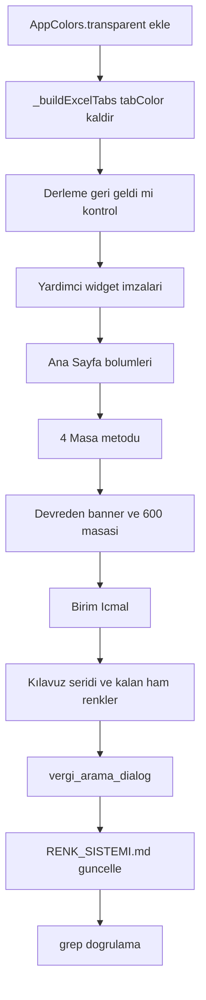

# Beyanname Modülü Renk Migrasyonu Planı

> **İlke:** *Renk süs değildir; kullanıcıyı yönlendirir.* Bir ekranda **tek vurgu rengi**
> ([`AppColors.primary`](lib/core/theme/app_colors.dart:59)) + gerektiğinde **durum renkleri**
> (`success` / `warning` / `danger` / `info`) kullanılır. Vergi türleri (KDV1, KDV2, Muhtasar,
> Damga, 600) bir **durum değildir**; bu yüzden bunları farklı renklerle ayırmak yasaktır
> (bkz. [`RENK_SISTEMI.md`](RENK_SISTEMI.md:79) Altın Kural 3-4).
>
> İlgili kurallar: [`RENK_SISTEMI.md`](RENK_SISTEMI.md:1) · [`AGENTS.md`](AGENTS.md:1)

---

## Hedef Çerçevesi — Yönlendir, Odakla, Hata Yaptırma

> Kullanıcı talebi doğrultusunda bu planın odağı "renkleri tokenlara taşımak" değil;
> **kullanıcıyı rahatsız etmeden yönlendiren, odağı koruyan ve hata yapmayı engelleyen**
> bir ekran kurmaktır. Renk, bunun aracıdır.

**İlke 1 — Rahatsız etme (sakin yüzey):** Bir ekranda tek vurgu ([`primary`](lib/core/theme/app_colors.dart:59)).
Parlak "Excel yeşili" barlar (`#A9D08E`), 5 farklı bölüm aksanı ve 7 renkli sekmeler **kaldırılır**;
göz yorulmaz, ekran gürültüsüz olur.

**İlke 2 — Yönlendir (nerede iş var?):** Renk, kullanıcının yapacağı işi işaret eder:
boş hücre `warningSubtle` ("buraya veri gir"), dolu hücre `successSubtle` ("tamam").

**İlke 3 — Odakla (neredeyim?):** Seçili sekme ve odaktaki hücre `primary` ile işaretlenir;
kalan her şey nötr tondadır. Böylece dikkat tek noktada toplanır.

**İlke 4 — Hata yaptırma (güvenli eylem):**
- Yıkıcı eylemler (Sil / Sıfırla / Reddet) → **`actionDestructive`**: tehlike sinyali, istemsiz tık azalır.
- Birincil eylemler (Yeni Birim Ekle / Personel Ekle / kaydet) → **`actionPrimary`**: doğru akışa yönlendirir.
- Toplam satırları → **nötr ton**: toplam ile veri karışmaz.
- Negatif değer `danger`, devreden `warning`, net ödenecek `success`: finansal durum bir bakışta doğru okunur.

**İlke 5 — Asla yalnızca renge güvenme (erişilebilirlik):** Her durum renginin yanında **ikon
veya metin** de bulunur. Renk körü bir kullanıcı da hata yapmamalıdır. (Örn. "Girilen/Boş"
rozetleri metinlidir; "ÖDENECEK"/"DEVREDEN" etiketleri yazılıdır.)

### Anlam → Renk Sözlüğü (bu ekran için bağlayıcı)

| Kullanıcı durumu | Token | Neden |
|---|---|---|
| Boş / bekleyen hücre | `warningSubtle` + `warningBorder` | "buraya veri gir" çağrısı |
| Dolu / girilmiş hücre | `successSubtle` + `successBorder` | "tamam" onayı |
| Odaktaki hücre | `primary` kenar (`focusRing`) | nerede olduğumu biliyorum |
| Seçili sekme | `primary` | neredeyim |
| Net ödenecek | `success` | olumlu sonuç |
| Devreden KDV | `warning` | dikkat, taşınan değer |
| Negatif / eksik | `danger` | sorun |
| Toplam / özet satırı | `neutralSubtle` | veri değil, sonuç |
| Sil / Sıfırla / Reddet | `actionDestructive` | yıkıcı eylem |
| Bilgi / not / mod | `infoSubtle` + `infoBorder` | nötr bilgi |
| Birim / rol etiketi | `neutralSubtle` | kimlik; durum değil |

---

## 0. ACİL DURUM — Dosya Şu An Derlenmiyor

Önceki oturumda [`beyanname_hesapla_screen.dart`](lib/features/beyanname/screens/beyanname_hesapla_screen.dart:1)
içindeki `final List<Color> _tabColors = ...` alanı **silindi**, ancak `_buildExcelTabs()`
metodu ([`satır 538`](lib/features/beyanname/screens/beyanname_hesapla_screen.dart:538))
hâlâ `_tabColors[i]` çağırıyor. Bu hâliyle **derlenmez**.

**İlk iş:** `_buildExcelTabs()` yeniden yazılıp `_tabColors` referansı kaldırılmalı ve
[`AppColors.transparent`](lib/core/theme/app_colors.dart:1) tokenı eklenmelidir.

---

## 1. Yeni / Eksik Token İhtiyacı

[`app_colors.dart`](lib/core/theme/app_colors.dart:1) içinde **7. Bileşen Tokenleri** bölümü
zaten mevcut. Eksik olan **tek** token:

| Yeni token | Değer | Gerekçe |
|---|---|---|
| `AppColors.transparent` | `Color(0x00000000)` | Sekme kenarlığında `Colors.transparent` ham rengi kullanılıyor |

> Yeni **anlamsal** renk gerekmez. Mevcut `success/warning/danger/info/neutral` + bileşen
> tokenleri yeterlidir.

---

## 2. Renk Karar Tablosu (eski ham renk → yeni token)

| Eski ham renk | Anlamı | Yeni token |
|---|---|---|
| `#1D4ED8`, `#2563EB`, `#0284C7`, `#7C3AED`, `#4338CA` (bölüm/sekme/buton vurguları) | Vurgu (tek renk olmalı) | `AppColors.primary` |
| `#059669`, `#15803D`, `#10B981`, `#047857`, `#D1FAE5`, `#DCFCE7`, `#A7F3D0`, `#ECFDF5`, `#F0FDF4`, `#86EFAC`, `#A9D08E` | "İyi/kâr" süsü **veya** Excel yeşili | Bağlama göre `success`/`successSubtle`/`successBorder` **veya** nötr `surfaceVariant` |
| `#D97706`, `#FEF3C7`, `#FDE68A`, `#FFFBEB`, `#F59E0B`, `#B45309`, `#92400E`, `#FEF08A` | Dikkat / bekleyen / devreden | `warning`/`warningSubtle`/`warningBorder` |
| `#DC2626`, `#EF4444`, `#C0392B`, `Colors.red` | Yıkıcı / olumsuz / negatif | `danger`/`actionDestructive` |
| `#64748B`, `#475569`, `#334155`, `#1E293B`, `#0F172A`, `Colors.grey`, `Colors.grey.shade*` | Nötr metin | `textSecondary`/`textPrimary`/`textMuted` |
| `#F1F5F9`, `#F8FAFC`, `#FAFAFA`, `Colors.white`, `#FFFFFF` | Nötr zemin | `surface`/`surfaceVariant`/`tabloSatirCift` |
| `#CBD5E1`, `#E2E8F0`, `#BFDBFE`, `#BAE6FD`, diğer kenarlıklar | Nötr kenarlık | `border`/`borderStrong` |
| `Colors.transparent` | Şeffaf | `AppColors.transparent` |

---

## 3. Dosya ve Bölge Bazlı Düzeltmeler

### 3.1 [`beyanname_hesapla_screen.dart`](lib/features/beyanname/screens/beyanname_hesapla_screen.dart:1) (~2134 satır)

| # | Bölge / Metot | Satır (yaklaşık) | Yapılacak |
|---|---|---|---|
| 1 | `_buildExcelTabs()` | 526–570 | `_tabColors` referansını kaldır. Zemin `surfaceVariant`, alt kenar `borderStrong`. Seçili sekme: zemin `surface`, kenar `primary`, `boxShadow: focusRing`, metin `primary`/`w800`. Seçili değil: zemin `transparent`, metin `textSecondary`/`w600` |
| 2 | AppBar + KPI + toolbar | 77–434 | ✅ **TAMAMLANDI** (önceki oturum) |
| 3 | Kılavuz şeridi (`_buildGuideStrip`) | 462–521 | Zemin `surface`, kenar `border`; "Girilen" → `success*`, "Boş/Bekleyen" → `warning*`; ikon/ipucu metni `textMuted`, açıklama `textSecondary`, lejant `textSecondary` |
| 4 | Ana Sayfa başlıkları (`_buildSheetTitle`) | 607, 673, 713, 751, 782 | `accentColor` parametresi **kaldırılır**; tüm başlıklar `primary` |
| 5 | Ana Sayfa tablo başlıkları (`_headerRow`) | 614–615, 679–680, 719–720, 757–758, 788–789 | `bg`/`textColor` parametreleri **kaldırılır**; tüm başlıklar `tabloBaslikZemin`/`tabloBaslikMetin` |
| 6 | Ana Sayfa bold satır `bg: #F8FAFC` | 627, 645 | `bg` parametresi kaldırılır; `isBold` zaten `tabloSatirCift` uygular |
| 7 | `_dividerRow('İNDİRİLECEK KDV')` | 634 | `bg: primarySubtle`, `textColor: primary` (alt başlık = tek vurgu) |
| 8 | `_highlightRow` çağrıları | 658–665, 700–705, 793, 797 | Ton eşlemesi: ÖDENECEK → `success`, DEVREDEN → `warning`, TOPLAM/özet → `neutral` |
| 9 | `_buildTableContainer` çağrıları | 667–668, 707–708, 736–737, 768–769, 799–800 | `borderColor`/`gridColor` argümanları **kaldırılır**; varsayılan `tabloKenarlik`/`tabloIzgara` |
| 10 | `_buildKdv1Masasi` | 822, 829, 848–849, 855, 914, 920, 931, 943, 960–961 | Başlık `primary`; "Yeni Birim Ekle" → `actionPrimary`/`textOnDark`; başlık satırı nötr; zebra `surface`/`tabloSatirCift`; net KDV `success`/`danger`; sil ikon `actionDestructive`; dialog buton `actionDestructive`; tablo kenarlık nötr |
| 11 | `_buildKdv2TevkifatMasasi` | 986, 993, 1003–1004, 1010, 1017, 1020, 1031–1032 | Başlık `primary`; "Tevkifatlı Fatura Ekle" → `actionPrimary`; başlık nötr; zebra nötr; tevkifat değeri `textPrimary` (bold); sil ikon `actionDestructive`; kenarlık nötr |
| 12 | `_buildMuhtasarMasasi` | 1100, 1107, 1117–1118, 1126, 1138, 1149–1150, 1169–1188, 1201–1202, 1220–1251 | Başlık `primary`; "Personel Ekle" → `actionPrimary`; başlık nötr; zebra nötr; sil ikon `actionDestructive`; Excel-yeşili "BİRİM BAZLI TOPLAMLAR"/"GENELTOPLAM" barları → `surfaceVariant` + `textPrimary`; genel toplam satırı → `toplamSatirZemin`/`toplamSatirMetin`; kenarlık nötr |
| 13 | `_buildDamgaMasasi` | 1274, 1280–1281, 1287, 1294, 1298, 1300–1301 | Başlık `primary`; başlık nötr; zebra nötr; matrah vurgusu `textPrimary`; `_highlightRow` → `neutral`; kenarlık nötr |
| 14 | `_buildDevredenKdvBanner` | 1318–1369 | Kart `surface`/`border`; tarih ikonu `info`; etiket `textPrimary`; alt metin `textSecondary`; devreden kutusu `warning*`; net ödenecek kutusu `success*` |
| 15 | `_build600Masasi` | 1391–1483 | Başlık `primary`; kümülatif notu → `infoSubtle`/`infoBorder`/`info`; başlık nötr; zebra nötr; vurgulu hücreler `primary`; toplam satırı `tabloSatirCift` veya `toplamSatirZemin`; kenarlık nötr; ipucu kutusu `notZemin`/`notCerceve`/`notMetin` |
| 16 | `_buildBirimIcmal` | 1529, 1547–1548, 1552–1554, 1562, 1571, 1581, 1591, 1601, 1614–1622, 1626–1627, 1641, 1653–1654, 1660, 1667, 1673–1684 | Başlık `primary`; başlık satırları nötr; DİŞ/TÖMER özel satırı `warningSubtle`; negatif KDV `danger`; toplam satırı `toplamSatirZemin`; kenarlık nötr |
| 17 | `_buildAyrismaToggle` | 1709–1712 | Mod göstergesi → `info`/`infoBorder` (durum değil, bilgi) |
| 18 | `_buildSheetTitle` | 1719 | `accentColor` parametresi **kaldırılır**; sol aksan çubuğu `primary` |
| 19 | `_buildTableContainer` | 1746–1752 | Varsayılanlar `tabloKenarlik`/`tabloIzgara`; zemin `surface` |
| 20 | `_headerRow` | 1767–1768, 1779 | `bg`/`textColor` parametreleri kaldırılır → `tabloBaslikZemin`/`tabloBaslikMetin` |
| 21 | `_dataRow` | 1796, 1806–1807 | Etiket `textPrimary`, değer `textPrimary`; `bg` parametresi kaldırılır |
| 22 | `_dividerRow` | 1817–1825 | Varsayılan `primarySubtle`/`primary` |
| 23 | `_highlightRow` | 1866 civarı | Zemin, ton renginin `*Subtle` türevi; metin ton rengi |
| 24 | `_singleCellRow` | 1867 | `Colors.grey` → `textMuted` |
| 25 | `_birimAdiBadge` | 1894, 1906–1916 | Metin `textPrimary`; rozet `neutralSubtle`/`borderStrong`/`textSecondary` (birim = nötr, kural 4) |
| 26 | `_cellText` | 1936 | Varsayılan `textPrimary` |

### 3.2 [`vergi_arama_dialog.dart`](lib/features/beyanname/screens/vergi_arama_dialog.dart:1)

| # | Bölge | Satır (yaklaşık) | Yapılacak |
|---|---|---|---|
| 1 | Scaffold + AppBar | 89–115 | Zemin `background`; AppBar `surface`; ikonlar `primary`; başlık `textPrimary`; alt başlık `textSecondary` |
| 2 | Filtre kartı | 128–131 | Zemin `surface`, kenar `border` |
| 3 | "N Kayıt" rozeti | 220–227 | `primarySubtle`/`primary`/`primary` |
| 4 | KPI kartları (8 farklı renk) | 238–245 | Hepsi `primary` (tek vurgu); "FİLTRE TOPLAMI" kartı `primary` + `isPrimary: true` |
| 5 | Boş durum | 256–267 | Metin `textSecondary`; tablo kenarı `border` |
| 6 | Tablo başlığı | 283, 293 | `tabloBaslikZemin`/`tabloBaslikMetin` |
| 7 | Zebra satırlar | 301 | `surface`/`tabloSatirCift` |
| 8 | Toplam vergi hücresi | 312 | `danger` DEĞİL → `textPrimary` (bold) |
| 9 | `_buildKpiCard` | 332, 343, 350 | `isPrimary` zemini `primary`, yazı `textOnDark`/`textOnDarkMuted`; diğerleri `surface` + `textSecondary`/`textPrimary` |
| 10 | `_cell` | 366 | Varsayılan `textPrimary` |

### 3.3 [`editable_cell.dart`](lib/features/beyanname/widgets/editable_cell.dart:1)
✅ **TAMAMLANDI** (önceki oturum). Doğrulama: yalnızca `AppColors.*` içermeli.

### 3.4 [`RENK_SISTEMI.md`](RENK_SISTEMI.md:1)
"4. Yaygın Örnekler" sonrasına **"Beyanname Renk Kurgusu"** bölümü eklenir:
sekme = tek vurgu, tablo başlığı = nötr, toplam satırı = nötr ton, durum = success/warning/danger/info,
hücre = dolu `successSubtle` / boş `warningSubtle` / odak `primary`.

---

## 4. Uygulama Sırası (derlemeyi bozmadan)



**Neden bu sıra:** Yardımcı widget imzaları (`_headerRow`, `_buildSheetTitle` vb.) **önce**
sadeleştirilir; böylece çağrı yerlerindeki renk argümanları tek tek temizlenir ve aynı iş
iki kez yapılmaz.

---

## 5. Doğrulama (Definition of Done)

1. **Derleme:** `flutter analyze` hatasız (özellikle `_tabColors` referansı kalmamalı).
2. **Ham renk taraması** — aşağıdaki regex `AppColors.` öğelerini **yakalamaz** (çünkü `\b`
   kelime sınırı "AppColors" içinde oluşmaz):
   ```
   search_files(regex: "\bColors\.|Color\(0x", path: "lib/features/beyanname")
   ```
   Beklenen sonuç: **0** (üretilen belge/PDF kodu hariç).
3. **Görsel tutarlılık:** Tek vurgu (`primary`) + yalnızca gerçek durumlarda durum renkleri.
4. **Mantık korunumu:** Bu migrasyon **yalnızca renk** değiştirir; sayı/formül/tablo yapısı,
   `EditableCell` davranışı ve state yönetimi **değişmez**.
5. **Nakli Yekün / fatura kurallarına dokunulmaz** ([`AGENTS.md`](AGENTS.md:1) "DOKUNULMAZLAR"
   bölümü) — bu iş beyanname modülü ile sınırlıdır.
6. **Erişilebilirlik:** Yalnızca renge bağlı anlam yok; her durum renginin yanında ikon/metin bulunur.
7. **Odak testi:** Ekranda tek `primary` vurgu olmalı (seçili sekme + odak hücresi); başka hiçbir öğe vurgu rengi taşımaz.
8. **Güvenli eylem ayrımı:** Sil/Sıfırla `actionDestructive`, ekle/kaydet `actionPrimary` — gözden geçirilir.

---

## 6. Notlar / Riskler

- 5 adet birebir aynı zebra satırı: `idx.isEven ? Colors.white : const Color(0xFFFAFAFA)`
  → `apply_diff` sırasında bağlam (sonraki `children:`) ile ayırt edilmeli.
- `const` varsayılan argümanlar: `AppColors.*` tokenları `static const` olduğundan
  `const` konumu korunur (sorun çıkmaz).
- Kapsam **yalnızca beyanname modülü**; diğer modüller (fatura, danışmanlık, yk_karar)
  ayrı iş kalemidir.

---

## 7. Tamamlanan: Yönlendirme + Odak + Hata Önleme

Kullanıcı talebi ("rahatsız etmeden yönlendir, odakla, hata yaptırma") doğrultusunda
renk migrasyonunun üzerine **davranışsal** iki katman eklendi.

### 7.1 `BeyannameGuideStrip` (kılavuz şeridi, ayrı bileşen)
- Dosya: [`lib/features/beyanname/widgets/beyanname_guide_strip.dart`](lib/features/beyanname/widgets/beyanname_guide_strip.dart:1)
- Eski satır içi `_buildAssistantGuideStrip` metodu **silindi**; şerit ayrı widget'a taşındı
  (monolitik dosya kuralı, [`AGENTS.md`](AGENTS.md:1) madde 12).
- Yatay `SingleChildScrollView` ile taşma/`Spacer` overflow riski giderildi.
- "Girilen / Boş-Bekleyen" rozetleri korundu; üzerine **denetim rozeti** eklendi.

### 7.2 `BeyannameDogrulama` (hata önleme motoru, saf)
- Dosya: [`lib/features/beyanname/services/beyanname_dogrulama.dart`](lib/features/beyanname/services/beyanname_dogrulama.dart:1)
- `UyariSeviye {hata, dikkat, bilgi}` → UI'da `danger`/`warning`/`info`.
- Kapsam bilinçli olarak kullanıcının erişebildiği hatalarla sınırlı; motorun türettiği
  alanlar (damga `matrah`, 600 `kümülatif`) yanlış alarm üretmemek için denetlenmez.
- Birim testi: [`test/beyanname_dogrulama_test.dart`](test/beyanname_dogrulama_test.dart:1) (9 test).

### 7.3 `beyanname_hesapla_screen.dart` düzeltmeleri
- `BeyannameGuideStrip(provider: provider)` çağrısı bağlandı; import eklendi.
- `_buildSummaryKpiBanner` içindeki **`Container(color: … decoration: …)` çakışması**
  düzeltildi (debug'da assertion ile çöküyordu) → `color` `BoxDecoration` içine alındı.
- Eski `_buildAssistantGuideStrip` metodu kaldırıldı.

### 7.4 Doğrulama durumu
- `search_files(regex: "\bColors\.|Color\(0x", path: "lib/features/beyanname")` → **0**.
- `execute_command` bu ortamda **reddedildiği** için `flutter analyze` / `flutter test`
  çalıştırılamadı; doğrulama grep + yazılan birim testleri + imza çapraz kontrolü ile yapıldı
  (`BeyannameProvider` getter'ları, model kurucuları ve motor API'leri elle doğrulandı).

> **Sıradaki iş (kapsam dışı):** diğer modüllerin renk migrasyonu — fatura → danışmanlık → yk_karar.
